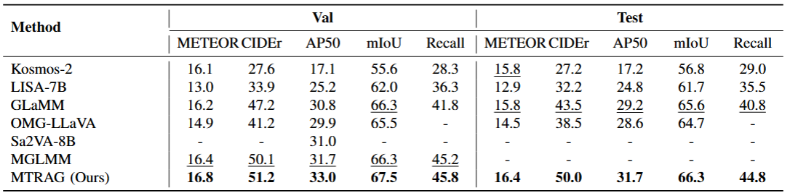
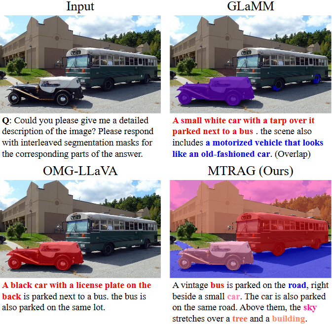

## MTRAG: Multi-Target Referring and Grounding via Hybrid Semantic-Spatial Integration
 Official implementation of "MTRAG: Multi-Target Referring and Grounding via Hybrid Semantic-Spatial Integration".

  

## 📖 Abstract
Fine-grained visual referring and grounding are critical for enhancing scene understanding and enabling various real-world vision-language applications. Although recent studies have extended multimodal large language models (MLLMs) to these tasks, they still face significant challenges in fine-grained multi-target scenarios. To address this, we propose MTRAG, a pixel-level multi-target referring and grounding framework that leverages semantic-spatial collaboration. Specifically, we introduce a Channel Extension Mechanism (CEM) that enables a global image encoder to extract global semantics and multi-region representations while retaining background context, without extra region feature extractors. Moreover, we introduce a grounding branch for pixel-level grounding and design a Hybrid Adapter (HA) to fuse semantic features from the MLLM branch with spatial information from the grounding branch, thereby enhancing the semantic-spatial alignment. For training, we meticulously curate MTRAG-D, a dataset comprising single- and multi-target referring and grounding samples derived from existing datasets and newly synthesized free-form multi-target referring instruction-following data. We also present MTR-Bench, a benchmark for systematic evaluation of multi-target referring. Extensive experiments across five core task, including single- and multi-target referring and grounding as well as image-level captioning, show that MTRAG consistently outperforms strong baselines on both multi- and single-target tasks, while maintaining competitive image-level understanding.

## 🛠️ Installation
See [install](./docs/install.md) for details.

## 🧩 Pre-trained weights

### Vicuna-7B-v1.5
MTRAG needs loading [vicuna-7b-v1.5](https://huggingface.co/lmsys/vicuna-7b-v1.5/tree/main) pre-trained weights.
### Alpha-CLIP Encoder
Our Global Image Encoder is initialized with the pre-trained weights of [Alpha-CLIP-L/14@336px](https://drive.google.com/file/d/1dUq1deeLcou26RuxZbBG57m2ALPWev6-/view?usp=drive_link), which has been fine-tuned on the GRIT-20M dataset. Place the downloaded weights in the path `./alpha_clip`.
### SAM weights
Our grounding branch, including both the perception encoder and decoder, is initialized from the ViT-H backbone of the Segment Anything Model (SAM) [ViT-H SAM model](https://dl.fbaipublicfiles.com/segment_anything/sam_vit_h_4b8939.pth). The encoder is kept frozen during training. Place the downloaded weights in the path `./checkpoints`.

## 📦 Prepare Datasets
See [datasets](./docs/datasets.md) for details.

## 🤖 Checkpoints
MTRAG-Full model🤗: [MTRAG-Full](https://huggingface.co/duujy/MTRAG-Full/tree/main)

## 🔎 Evaluation
See [evaluation](./docs/evaluation.md) for details.

## 📊 Results

### Quantitative Results
Performance on Grounded Conversation Generation dataset.

  

### Qualitative Results  
Qualitative comparison with GLaMM and OMG-LLaVA on the grounded conversation generation task.

  

## Acknowledgement
Thanks for great works of [GLaMM](https://github.com/mbzuai-oryx/groundingLMM), [LLaVA](https://github.com/haotian-liu/LLaVA) and [SAM](https://github.com/facebookresearch/segment-anything). Our code is based on them.